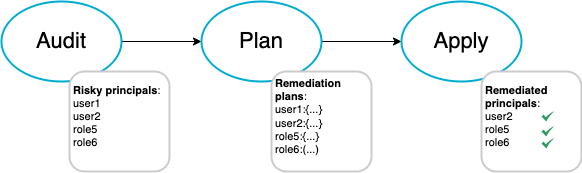

# IAM-Deescalate

```text
  _____          __  __        _____
 |_   _|   /\   |  \/  |      |  __ \
   | |    /  \  | \  / |______| |  | | ___  ___  ___  ___
   | |   / /\ \ | |\/| |______| |  | |/ _ \/ _ \/ __|/ __|
  _| |_ / ____ \| |  | |      | |__| |  __/  __/\__ \ (__
 |_____/_/    \_\_|  |_|      |_____/ \___|\___||___/\___|
```

IAM-Deescalate helps mitigate privilege escalation risk in AWS identity and access management (IAM). It identifies the IAM users and roles with privilege escalation risk using NCC Group's [PMapper](https://github.com/nccgroup/PMapper) and creates a set of policies to "deescalate" the risk. IAM-Deescalate was developed when we were working on the [Cloud Threat Report Vol. 6](https://cloudthreat.report). More information about the tool can be found in this [blog](https://unit42.paloaltonetworks.com/iam-deescalate/).

## Summary

- [IAM-Deescalate](#iam-deescalate)
  - [Summary](#summary)
  - [How does it work?](#how-does-it-work)
  - [Let's get started](#lets-get-started)
  - [Required permissions](#required-permissions)
  - [Installation](#installation)
    - [Host installation](#host-installation)
    - [Build a Docker image](#build-a-docker-image)
  - [Usage](#usage)
  - [audit](#audit)
  - [plan](#plan)
  - [apply](#apply)
  - [revert](#revert)
  - [Support](#support)
  - [Using Docker](#using-docker)
  - [Test](#test)
  - [Sample Remediation Plan](#sample-remediation-plan)

IAM-Deescalate has only four commands, `audit`, `plan`, `apply`, and `revert`.

- **audit** command uses PMapper to model an AWS account as a graph, and searches for principals risky for privilege escalation.

- **plan** command analyzes the privilege escalation risk and creates a remediation plan for each risky principal. Users should review the plans and decide which policies to apply.

- **apply** command inserts inline policies to risky principals based on the plans. Note that applying these policies may impact operations if the remediated identities require the revoked permissions.

- **revert** command removes all the inserted policies previously applied.



## How does it work?

PMapper models the identities in an AWS account as a directed graph, in which each node represents a principal (user or role) and each edge represents a transition from one principal to another. node A -> node B indicates that principal A can authenticate as principal B. For example, if user A can assume role B, then there is an edge directed from node A to node B. Similarly, if user C can pass role B to an EC2 instance that user C controls, then there is an edge directed from user C to role B. With this graph, one can find the possible paths between any two nodes.

A node (principal) is risky for privilege escalation if this node is NOT an admin principal but has a path to an admin principal.

IAM-Deescalate calculates all the possible edges from non-admin principals to admin principals. These are the edges that allow privilege escalation. IAM-Deescalate attempts to break these edge to eliminate the privilege escalation risk. To break an edge from node A to node B, IAM-Deescalate revokes a few permissions on principal A so that principal A can no longer authenticate as principal B. IAM-Deescalate revokes these permissions by inserting an [inline policy](https://docs.aws.amazon.com/IAM/latest/UserGuide/access_policies_managed-vs-inline.html#inline-policies) with explicit [deny](https://docs.aws.amazon.com/IAM/latest/UserGuide/reference_policies_evaluation-logic.html).

To understand why one principal can authenticate as another principal, IAM-Deescalate analyzes the `reason` property in each PMapper's [Edge](https://github.com/nccgroup/PMapper/blob/master/principalmapper/common/edges.py) instance. The `reason` property stores human-readable text explaining the relationship between the two connected principals. Note that if PMapper updates these descriptions, IAM-Deescalate will likely fail to interpret the relationship correctly.

## Let's get started

To get started, you need a [Python3](https://www.python.org/downloads/) environment and a credential with sufficient permissions to access the targeted AWS account. The credential needs to be stored in a [credential file(<https://docs.aws.amazon.com/cli/latest/userguide/cli-configure-files.html>)] on the host. By default, AWS's client tools and libraries look for the credential file at `~/.aws/credentials`. However, this default path can be changed by setting the environment variable `AWS_SHARED_CREDENTIALS_FILE`

## Required permissions

[required_permissions.json](required_permissions.json) lists the minimal set of AWS permission required for both IAM-Deescalate and PMapper (v1.1.5).

## Installation

[requirements.txt](requirements.txt) lists the three dependencies for both IAM-Deescalate and PMapper (v1.1.5).

### Host installation

```bash
mkdir iam && cd iam
git clone https://github.com/nccgroup/PMapper.git
git clone https://github.com/PaloAltoNetworks/IAM-Deescalate.git
cp IAM-Deescalate/misc/gathering.py PMapper/principalmapper/graphing/gathering.py
cp IAM-Deescalate/misc/case_insensitive_dict.py PMapper/principalmapper/util/case_insensitive_dict.py
cd IAM-Deescalate
pip3 install -r requirements.txt
```

### Build a Docker image

```bash
git clone https://github.com/PaloAltoNetworks/IAM-Deescalate.git
cd IAM-Deescalate
docker build -t iam-deesc .
```

<!--  -->

## Usage

```bash
usage: iam_deesc.py [-h] [--profile PROFILE] {audit,plan,apply,revert} ...

optional arguments:
  -h, --help            show this help message and exit
  --profile PROFILE     AWS profile to use. If not provided, the default profile will be used

subcommand:
  The subcommand to use among this suite of tools

  {audit,plan,apply,revert}
                        Select a subcommand to execute
    audit               Pull the IAM information from an AWS account and serach for principals with privilege escalation risks. E.g., python3 iam_deesc.py --profile my_prof audit
    plan                Use the audit result to create a remediation plan. If --auto flag is specified, the "patch_me" fields in each plan will be set to 1
    apply               Apply the remediation plan.This command needs to be run after the plan commmand finishes. E.g., python3 iam_deesc.py --profile my_profile apply
    revert              Revert the changes made by the apply command. If --all flag is specified, IAM-Deescalate will check EVERY user and role in this account
```

## audit

The `audit` command models the principals as a graph using [PMapper](https://github.com/nccgroup/PMapper/wiki/CLI-Reference#graph-create) and identifies the principals with privilege escalation risks.

```bash
python3 iam_deesc.py --profile my_prof audit
```

## plan

The `plan` command creates remediation plans based on the audit result. The plans are stored under `./output/plan/`. By default, all the "patch_me" fields are marked as 0, meaning that no actions will be taken when running the `apply` command. Users need to go through each plan and manually mark patch_me to 1. Read the [Sample Remediation Plan](#sample-remediation-plan) section for more detail.

```bash
python3 iam_deesc.py --profile my_prof plan
```

If `--auto` flag is specified, the `plan` command will automatically select a remediation strategy for each principal.

```bash
python3 iam_deesc.py --profile my_prof plan --auto
```

## apply

The `apply` command takes the policies with "patch_me" marked as 1 and attaches them to the risky principals

```bash
python3 iam_deesc.py --profile my_prof apply
```

## revert

The `revert` command removes all the attached remediation policies.

```bash
python3 iam_deesc.py --profile my_prof revert
```

## Support

Please read SUPPORT.md for details on how to get support for this project.

## Using Docker

First build an image following the [Build a Docker image](#build-a-docker-image) instruction.
Use Docker to execute every command.

```bash
docker run --rm -it -v [path to aws credential file]:/.aws/credentials -v [path to output directory]:/app/IAM-Deescalate/output iam-deesc [command]
```

Examples:

```bash
docker run --rm -it -v /home/ec2-user/.aws/credentials:/.aws/credentials -v /home/ec2-user/iam/IAM-Deescalate/output:/app/IAM-Deescalate/output iam-deesc --profile my_prof audit

docker run --rm -it -v /home/ec2-user/.aws/credentials:/.aws/credentials -v /home/ec2-user/iam/IAM-Deescalate/output:/app/IAM-Deescalate/output iam-deesc --profile my_prof plan --auto
```

## Test

BishopFox's Seth Art created a cool project called [IAM Vulnerable](https://github.com/BishopFox/iam-vulnerable) that can quickly build 31 different AWS IAM privilege escalation scenarios. It uses [Terraform](https://learn.hashicorp.com/collections/terraform/aws-get-started) to easily provision and deprovision each scenario. IAM-Deescalate used IAM Vulnerable extensively during development.

## Sample Remediation Plan

[Here](bob.json) is a sample remediation plan. In this plan, user bob is risky for privilege escalation. Two possible privilege escalation paths are identified. The first path allows bob to escalate to user it_admin, and the second path allows bob to escalate to role it_admin_role.

To remediate the first attack path, we need to prevent bob from creating an access key for it_admin. If you agree to apply this policy, set the "patch_me" field to 1.

There are two options to remediate the second attack path. Each option is represented as a policy, and applying one of these two policies can remediate the risk. The first policy prevents bob from passing the it_admin_role to EC2 instances. The second policy prevents bob from associating an instance profile to EC2 instances. If you agree with any of the policies, set its "patch_me" field to 1.
